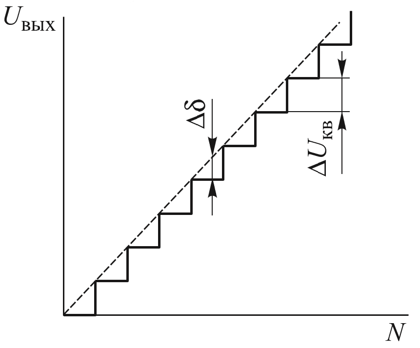

# Лабораторная работа № 1.2 Платы сопряжения ЦАП–АЦП для ПЭВМ
### КРАТКИЕ ТЕОРЕТИЧЕСКИЕ СВЕДЕНИЯ 
Модульный принцип организации ПЭВМ позволяет подключать измерительную аппаратуру через соответствующий интерфейс непосредственно к магистрали ПЭВМ. На основе этого принципа, как правило, создают специализированные измерительно-вычислительные комплексы, ориентированные на подключение к ЭВМ небольшого числа измерительных и управляющих устройств. Для создания гибких, легко перестраиваемых и наращиваемых автоматизированных систем, необходимых в лабораторных исследованиях, рассмотренный подход практически не используется, поскольку физическая нагрузочная способность магистрали ПЭВМ ограничена. Непосредственное подключение к магистрали большого числа разнородных элементов измерительной аппаратуры и элементов управления практически невозможно, так как увеличение нагрузок приводит к снижению надежности работы ПЭВМ и всего комплекса в целом. 
В автоматизированных системах с небольшим числом каналов связи чаще всего применяют измерительно-управляющие платы (Plugin-Card), часто называемые платами ЦАП–АЦП. Их преимущества: во-первых, между ЭВМ и устройствами ввода-вывода отсутствуют промежуточные звенья, а во-вторых, вследствие расположения непосредственно в слотах на материнской плате IBM/PCсовместимого компьютера может быть существенно повышена скорость обмена данными и командами. Выпускаются платы с собственными микропроцессорными средствами обработки, быстрыми буферами-накопителями типа FIFO (First Input — First Output), а технические характеристики лучших образцов приближаются к аналогичным для функциональных модулей магистральномодульных систем.  

Типичный состав плат ЦАП–АЦП следующий: входной коммутатор — 8–64 канала; АЦП — 8–16 разрядов; ЦАП — 8–16 разрядов; встроенные программируемые счетчики/таймеры; порты цифрового ввода-вывода (8–128 разрядов).  
Недостатки использования плат ЦАП–АЦП для автоматизации: а) отсутствие в относительно дешевых платах выходного буфера в ЦАП, что вызывает необходимость работы в реальном времени; б) относительная дороговизна плат и потребность (особенно для импортных плат) в дорогом лицензионном программном обеспечении; в) невысокая мощность сигналов управления, ограниченная параметрами блока питания ПЭВМ. 

Измерительно-управляющие комплексы на базе плат ЦАП– АЦП целесообразно создавать и использовать при удалении комплекса от объекта исследования не более чем на несколько метров (в противном случае будет существенно нарушаться синхронизация процессов и снижаться надежность обмена данными, что повлечет за собой необходимость применения дорогостоящих фильтров и других систем помехоподавления). 

Кроме того, применение таких комплексов целесообразно при управлении физическими объектами, в которых процессы изменяются относительно медленно, не требуют высокого быстродействия, а также при небольшом числе каналов измерения и управления и плат сопряжения, необходимых для автоматизации стенда, так как число слотов расширения в ПЭВМ ограничено. 
Несколько снизить стоимость автоматизации стенда позволяет использование внешних систем сбора данных, подключаемых к ПЭВМ через последовательный порт или USB-шину, однако при этом, как правило, снижается быстродействие системы. Применение USB-интерфейса предоставляет пользователю ряд существенных преимуществ. Так, при использовании стандартных устройств АЦП/ЦАП для ПЭВМ, подключаемых через шину ISA либо PCI, в процессе решения некоторых задач возникают неудобства, связанные с необходимостью установки платы внутрь ПЭВМ, с конфигурированием компьютера для корректной работы плат, а также с невозможностью использования таких плат с портативными компьютерами типа ноутбука.  

Одним из возможных вариантов решения сформулированных выше проблем, когда необходимо иметь устройство, которое можно было бы быстро и удобно подключать к стандартным ПЭВМ, а также к компьютерам типа ноутбука и промышленным компьютерам, является использование внешних модулей, подключаемых по шине USB. Благодаря встроенным линиям питания, обеспечивающим силу тока до 500 мА, шина USB часто позволяет применять устройства без внешнего блока питания.  

Все подключаемые к шине USB устройства конфигурируются автоматически благодаря реализации принципа Plug&Play, в соответствии с которым операционная система сама определяет тип подключенного устройства и загружает необходимый для данного устройства драйвер. При этом не возникает вопросов о номере используемого прерывания, адресах портов, прямом доступе к памяти и т. д. Кроме того, спецификация шины USB допускает «горячее» (т. е. при включенном питании компьютера) подключение/отключение устройств.  

В качестве примера платы ЦАП–АЦП в лабораторной работе рассматриваются модуль E14-440, содержащий встроенный процессор, и модуль E14-440 без цифрового процессора. Модуль E14-440 является современным универсальным программно-аппаратным устройством для использования с шиной USB, предназначенным для построения многоканальных измерительных систем ввода, вывода и обработки аналоговой и цифровой информации в составе персональных IBM-совместимых компьютеров. 

Модуль E14-440 обладает следующими функциональными характеристиками:

*	цифровой сигнальный процессор (Digital Signal Processor — DSP) ADSP-2185M с тактовой частотой работы 48 МГц;  
*	16 дифференциальных каналов или 32 канала с общей «землей» для аналогового ввода при возможности автоматической корректировки данных;  
*	максимальная частота работы 14-битного АЦП — 400 кГц;  
*	два входа для внешней цифровой синхронизации ввода аналоговых сигналов;  
*	порт цифрового ввода/вывода, имеющий 16 входных и 16 выходных линий;  
*	два канала аналогового вывода 12-битного ЦАП с максимальной суммарной частотой 125 кГц;  
*	максимальная пропускная способность по шине USB — не более 500 кСлов/с.  

Модуль E14-440 является малогабаритным многофункциональным измерительным устройством, которое позволяет решать ряд типичных задач обмена данными с экспериментальной плазменной установкой:  
*	непрерывный потоковый многоканальный ввод аналоговой информации с суммарной частотой до 400 кГц;  
*	непрерывный потоковый двухканальный вывод аналоговой информации с суммарной частотой до 125 кГц;  
*	одновременный непрерывный потоковый ввод/вывод аналоговой информации с частотами 250 кГц (ввод) и 125 кГц (вывод);  
*	однократное асинхронное управление 16 цифровыми входными и 16 цифровыми выходными линиями. Эта операция достаточно медленная — время выполнения порядка 10…20 мс.  

Этот модуль можно рассматривать в качестве компактного и недорогого устройства для многоканального потокового сбора информации. Он представляет собой законченную систему со встроенным процессором. Это обстоятельство позволяет пользователю создавать собственные специализированные алгоритмы реального времени по обработке сигналов и реализовывать их на уровне программирования процессора, установленного в модуле.  

Несмотря на то что в модуле установлен процессор, большинству пользователей, как правило, не приходится знакомиться с его системой команд, поскольку в комплект поставки модуля входит управляющая программа для процессора, позволяющая осуществлять ввод-вывод информации в различных режимах. В драйвере реализованы наиболее часто используемые алгоритмы ввода-вывода, поэтому написание собственных программ для сигнального процессора требуется только при решении специализированных задач, когда возникает, например, необходимость в перенесении отлаженных алгоритмов с платформы IBM PC. Так, DSP может обеспечивать ввод информации в режиме реального времени, анализировать полученные данные и сообщать ПЭВМ о результатах работы.  

Если модуль E14-440 используется только для обеспечения стандартного многоканального ввода информации в компьютер, нет необходимости программирования работы процессора на языке Ассемблер. Пользователю системы не придется также изучать низкоуровневое программирование модуля, поскольку в комплект штатной поставки входят готовые высокоуровневые библиотеки программ, написанных на языке С++.  

Одно из главных преимуществ применения именно цифрового сигнального процессора заключается в том, что чисто программным образом можно достаточно гибко изменять в довольно широких пределах алгоритмы работы модуля с периферийными устройствами. Кроме того, он поддерживает выполнение необходимой предварительной обработки данных. Так, с помощью прилагаемого драйвера могут быть организованы два циклических буфера: для приема данных с АЦП и для вывода данных на ЦАП. При поступлении из ПЭВМ команды на запуск АЦП драйвер ожидает накопления данных в первой половине буфера АЦП. После того как она заполнится готовыми данными с АЦП, дается команда на их передачу в ПЭВМ. При этом не прекращается сбор данных во вторую половину. После накопления данных во второй половине буфера опять дается команда на их передачу в ПЭВМ и продолжается сбор данных уже в первую половину. Такой алгоритм сбора данных и обмена ими продолжается до тех пор, пока из ПЭВМ не придет команда на останов работы АЦП. Интерфейсные функции прилагаемой библиотеки программ Lusbapi позволяют реализовывать разнообразные алгоритмы работы модуля E14-440 с АЦП независимо от состояния ЦАП, но основным режимом работы модуля является непрерывный потоковый сбор данных с АЦП.  

Аналогичный принцип реализован и в алгоритме работы ЦАП. 
Это позволяет значительно (по сравнению с системой без DSP) повысить скорость выполнения полного цикла «измерение — управление». Кроме того, в модуле установлено последовательное пользовательское программируемое постоянное запоминающее устройство, которое позволяет значительно расширить возможности реализации различных режимов работы.  

Описание используемых модулей приведено в приложении 1. 

## ПОРЯДОК ВЫПОЛНЕНИЯ РАБОТЫ 
Внимание! При выполнении лабораторных работ подключение к внешним разъемам можно производить только при выключенном питании модуля Е14. Необходимо внимательно следить, чтобы в процессе эксплуатации не было случайного замыкания цепей источника сигнала и общей точки, так как это может вызвать короткое замыкание и выход модуля из строя. 

### Этап 1. Измерение аналоговых сигналов с помощью АЦП 
В работе используется внешний модуль ввода-вывода E14-140 отечественной компании L-CARD. Модуль снабжен 14-битным многоканальным АЦП с мультиплексированием каналов. Максимальная частота преобразования 100 кГц (время преобразования 10 мкс). Связь с компьютером и питание модуля осуществляются по USB-интерфейсу, что позволяет выполнять «горячее» подключение к работающему компьютеру. 
Модуль имеет два разъема для подключения внешних устройств 
(для цифровых сигналов и для аналоговых сигналов). Диапазон внешних сигналов должен быть ограничен значением 10 В. Входное сопротивление АЦП более 10 МОм. Модуль может быть сконфигурирован для получения сигналов как в однофазном (с общей «землей») режиме, так и в дифференциальном режиме. В первом случае доступно 32 входных канала, во втором — 16. 
Для получения, обработки и сохранения данных на ПЭВМ используется специальное программное обеспечение. При этом его можно создавать самостоятельно или брать готовые программные продукты. Возможности пакета PowerGraph позволяют использовать ПЭВМ в качестве вольтметра, самописца, осциллографа. 
После запуска программы PowerGraph необходимо выбрать в предложенном списке устройство, выполнить конфигурирование аналоговых каналов (для каналов 1 и 3 установить однофазный режим, кроме того, необходимо установить диапазон входного сигнала). 
#### Упражнение 1. Измерение постоянного напряжения. На канал 1 со специального источника подается постоянное напряжение милливольтового диапазона — запускается самописец. Сигнал на экране самописца изменяют, вращая рукоятку источника.  
В окне настроек канала можно задать диапазон входного сигнала, выбором диапазона сигнала — изменять разрешение АЦП. Так, предельное разрешение АЦП составляет от 19 мкВ в диапазоне 0,156 В до 1,22 мВ в диапазоне 10 В. 
#### Упражнение 2. Измерение переменного сигнала. На канал 3 подается последовательность импульсов с частотой 500 Гц. Изменяя масштаб по оси времени, необходимо добиться четкого отображения сигнала на экране самописца. Открыть спектроанализатор. Проведенный Фурье-анализ позволяет определить частоту сигнала и частоты остальных гармоник.  
В меню «Сервис — Частота регистрации» доступна функция изменения частоты дискретизации АЦП. Задавая частоту дискретизации ниже 1 кГц, можно проиллюстрировать выполнение теоремы Котельникова, согласно которой частота дискретизации должна превышать частоту сигнала в 2 раза. 
Самостоятельная работа. Выбрать канал 1. Поворотом ручки регулятора источника напряжения изменить сигнал на экране самописца. В окне настройки канала изменить диапазон входного сигнала, выполнить калибровку сигнала (умножить и сместить).  

Выбрать канал 3. Изменением масштаба шкалы времени добиться четкого отображения периодического сигнала на экране самописца. Выбрать директиву «Спектроанализатор» и определить частоту сигнала. 

### Этап 2. Использование среды LabVIEW  при измерении аналоговых сигналов 
Как правило, при создании сложных систем сбора данных и автоматического управления функциональности готовых программных продуктов не хватает. В этом случае необходимо разрабатывать собственные программы. Одним из способов реализации этой задачи является использование среды разработки на языке графического программирования LabVIEW. 
Программы LabVIEW называют виртуальными приборами. При создании и отладке виртуальный прибор состоит из двух окон: лицевой панели, на которой располагаются элементы управления и визуализации, и блок-диаграммы, где реализован программный алгоритм. 
Блок-диаграмма содержит функциональные узлы (источники, приемники сигнала, элементы преобразования данных), которые соединяются между собой проводниками. Проводники обеспечивают передачу данных от одного функционального узла к другому. 
#### Упражнение 3. Исследование виртуального прибора.
Создать новый виртуальный прибор. Сконфигурировать ввод сигнала. Создать блок вычисления среднего значения. Вывести графики исходного и усредненного сигналов. 

### Этап 3. Применение цифроаналоговых преобразователей  
Цифроаналоговый преобразователь — это устройство для преобразования цифровой информации в аналоговую форму. Принцип работы ЦАП состоит в суммировании аналоговых сигналов, пропорциональных весам разрядов входного цифрового кода, с коэффициентами, равными нулю или единице в зависимости от значения разряда кода. Применяют ЦАП для связи цифровых управляющих систем с устройствами, которые управляются аналоговым сигналом. Значение напряжения, соответствующее единице цифрового кода, называют шагом квантования ΔUкв. На рис. 1.2.1 показана диаграмма изменения выходного напряжения Uвых при подаче на вход ЦАП цифрового кода, изменяющегося последовательно от нуля до N.

*Рис. 1.2.1. Диаграмма выходного напряжения ЦАП ( — погрешность дискретизации)*

Рассмотрим основные параметры ЦАП, определяющие точность преобразования и качество его работы.  
1.	Разрядность (число разрядов) — количество разрядов входного кода n, которое характеризует число степеней квантования  N = 2n – 1. 
2.	Абсолютная разрешающая способность da — минимальное значение изменения сигнала на выходе при изменении входного кода на единицу (цена младшего разряда). Ее определяют как  da =Uп.ш /(2n – 1), где Uп.ш — напряжение полной шкалы, соответствующее внешнему опорному напряжению ЦАП. Численно абсолютная разрешающая способность равна шагу квантования ΔUкв. 
3.	Время установления (преобразования) — интервал времени от момента изменения кода на входе ЦАП до момента установления выходного сигнала в заданных пределах. 
4.	Максимальная частота преобразования — наибольшая частота смены кода, при которой заданные параметры соответствуют установленным нормам. 
5.	Абсолютная погрешность преобразования в конечной точке шкалы — отклонение значения выходного напряжения от номинального, соответствующего конечной точке шкалы функции преобразования. Измеряется в единицах младшего разряда преобразования или в процентах. 
6.	Нелинейность преобразования — максимальное отклонение реальной функции преобразования от идеальной (прямая линия).  

Существуют и другие параметры, характеризующие исполнение ЦАП и особенности его функционирования, в их числе входное напряжение, ток потребления, диапазоны выходного напряжения и силы тока. 
Основные принципы работы и влияние параметров ЦАП на качество преобразования рассмотрим на примере двухканального  12-битного ЦАП, размещенного во внешнем модуле ввода-вывода Е14-440. Основные параметры ЦАП этого модуля представлены в приложении 1. Управление работой модуля E14-440 осуществляется с помощью программного пакета PowerGraph. 
Упражнение 4. Измерение постоянного напряжения на выходе ЦАП. Рассчитать абсолютную разрешающую способность для данного ЦАП. В окне «Тип сигнала» программы PowerGraph выбрать постоянный сигнал напряжением (в вольтах), равным шагу квантования. Выбрать канал 1. Запустить работу ЦАП, нажав кнопку «Пуск». Проверить показание мультиметра, подключенного к выходу ЦАП. Задать в программе значение уровня выходного сигнала, не кратное шагу квантования, и проверить показание мультиметра. Сделать вывод о дискретном изменении напряжения на выходе ЦАП. 
Упражнение 5. Построение диаграммы выходного напряжения ЦАП. Построить диаграмму выходного напряжения, изменяя в программе PowerGraph уровень сигнала (в рамках рабочего диапазона ЦАП 5 В) и выполняя соответствующие измерения напряжения мультиметром. Попробовать оценить абсолютную погрешность преобразования в конечной точке шкалы и нелинейность преобразования. В случае недостаточной точности используемого мультиметра сделать вывод о невозможности такой оценки. 
Самостоятельная работа. В окне «Тип сигнала» программы PowerGraph последовательно указать предлагаемые на выбор тестовые сигналы («синусоида», «ступенька», «треугольник») с различными значениями амплитуды и частоты. С помощью осциллографа проверить изменение напряжения на выходе канала ЦАП. 

### Этап 4. Цифровые входные и выходные линии 
Для обмена информацией между цифровыми устройствами, построенными на электронных логических элементах, используют цифровые входные и выходные линии. Передающиеся по ним цифровые сигналы имеют два стабильных уровня — уровень логического нуля и уровень логической единицы. У микросхем, выполненных по различным технологиям, логические уровни могут различаться. Логические элементы могут работать в режимах положительной и отрицательной логики. Для электронных логических элементов в режиме положительной логики логической единице соответствует высокий уровень напряжения, а логическому нулю — низкий уровень напряжения. В режиме отрицательной логики логической единице соответствует низкий уровень напряжения, а логическому нулю — высокий. 

В идеальном случае все сигналы логических элементов существовали бы в виде двух предельных уровней напряжения (например, 0 и +5 В) и никогда от них не отклонялись. Однако в реальности уровни напряжения цифровых сигналов могут отличаться от идеальных вследствие паразитных падений напряжения и шумов. 

Следует отметить, что диапазон допусков по уровням выходного сигнала обычно ýже, чем входного сигнала. Разность допусков между входным и выходным сигналами называют запасом схемы по помехоустойчивости. 
Наибольшее распространение получили логические элементы на основе биполярных транзисторов — ТТЛ-элементы (транзистор-транзисторная логика) и на основе полевых транзисторов — КМОП-элементы (комплементарные, на основе переходов металл — оксид — полупроводник). 

Принцип работы цифровых входных и выходных линий рассмотрим для модуля ввода-вывода Е14-440. На модуле имеются цифровые ТТЛ-совместимые входные и выходные линии, выполненные на КМОП-элементах при напряжении питания +5 В. Параметры цифровых линий представлены в приложении 1. Управление работой модуля E14-440 осуществляется с помощью программного пакета PowerGraph. 

#### Упражнение 6. 

Проверка работы цифровых выходов. С помощью интерфейса программы PowerGraph поставить напротив номеров всех каналов галочки, т. е. подать на все цифровые выходы логическую единицу. На разъеме платы должны загореться светодиодные лампочки. С помощью мультиметра измерить уровень напряжения на цифровых выходах. Сделать вывод о вхождении этого значения в диапазон допусков напряжения высокого уровня. Выставить на всех цифровых выходах логический нуль. С помощью мультиметра убедиться в отсутствии напряжения на каналах выходного порта. Представить выходной управляющий сигнал в шестнадцатеричной форме. 

#### Упражнение 7. 

Проверка работы цифровых входов. С помощью интерфейса программы PowerGraph убедиться, что напротив всех цифровых входов отсутствуют галочки, т. е. модуль  E14-440 воспринимает отсутствие напряжения как логический нуль. Соединить с помощью кабеля один из цифровых входов с выводом +5 В, расположенным на том же разъеме. С помощью интерфейса программы PowerGraph убедиться, что напротив замкнутого на +5 В канала появилась галочка и модуль воспринял напряжение +5 В как логическую единицу. 

## СОДЕРЖАНИЕ ОТЧЕТА 
1.	Основные сходства и различия в модулях сопряжения Е14-140 и Е14-440. Сравнение технических характеристик этих устройств при проведении операций измерения и управления. 
2.	Краткое описание используемых в работе программных сред для управления сбором данных, аналоговым и цифровым каналами.  
3.	Сгенерированные цифровые управляющие сигналы в двоичном и шестнадцатеричном коде. 
4.	Скриншоты интерфейсов используемых программных сред для различных тестовых сигналов («синусоида», «ступенька», «треугольник»).  
5.	Листинг интерфейса созданного в LabVIEW виртуального прибора: лицевой панели и блок-диаграммы. 

## КОНТРОЛЬНЫЕ ВОПРОСЫ 
1.	Каковы принципы сопряжения экспериментальной установки с ЭВМ?  
2.	Сформулируйте перечень и назначение основных элементов схемы сопряжения. 
3.	Какие стандарты на управляющие и измерительные комплексы вы знаете? 
4.	Каковы особенности интерфейсов первого поколения? Приведите примеры.  
5.	Какие типы устройств сопряжения с объектом вы знаете? Приведите их сравнительный анализ. 
6.	Для каких информационно-управляющих систем целесообразно использовать платы сопряжения ЦАП–АЦП? Каковы их разновидности, достоинства и недостатки?  
7.	В каких случаях используют внешние устройства сопряжения ЭВМ с экспериментальным стендом? В чем их достоинства и недостатки?  
8.	Какие вы знаете способы обмена информацией ЭВМ с внешними устройствами? Что такое ТТЛ-стандарт? 
9.	Для чего используется графический процессор в USBустройствах сопряжения? Сравните характеристики систем с графическим процессором и без него.  
10.	Как вы можете сформулировать основные принципы и приемы графического программирования в среде LabVIEW? 

